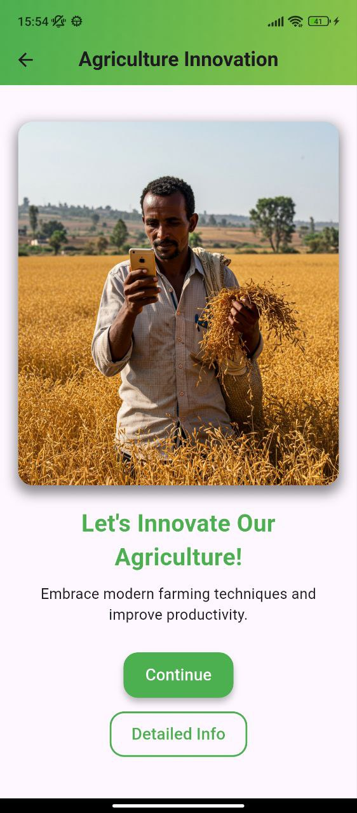
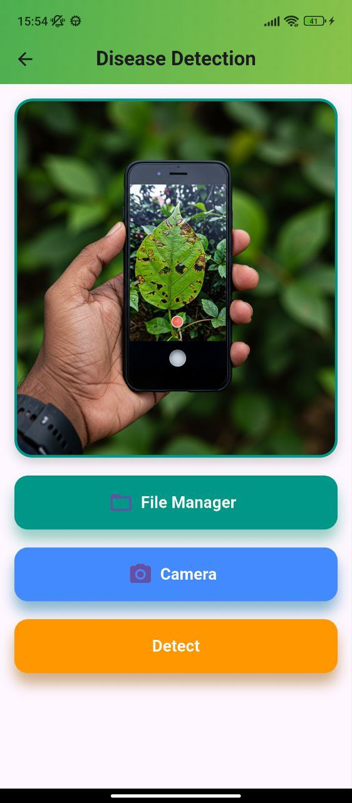

# 🌾 Smart Gebere  
_A smarter way to cultivate success._  

<div align="center">  
  <h3>📽️ Watch the Pre-Review Video</h3>  
  <a href="https://youtu.be/C8Kw2S8Khf0">  
      
  </a>  
</div>  

**Smart Gebere** helps farmers plan cultivation, detect crop disease, and use weather + location-aware guidance.

> **Important scope note**
> This roadmap intentionally **does NOT include push notifications**. (Requested: “don’t implement notification”.)

## 🌟 Key Features 🌟  

### 🌽 **Crop Recommendations**  
💡 _"What should I plant today?"_  
- Using **GPS data** and **manual inputs**, we analyze soil, weather, and historical data to recommend the **best crops** for your farm.  

### 🦠 **Disease Detection**  
📸 _"Oh no! My crops look sick."_  
- Snap a photo of your crops 🌾, and our AI will detect any diseases 🧪.  
- Get actionable advice on treatment and prevention 💊.  

### 🌤️ **Weather Forecasts**  
📅 _"What’s the forecast for tomorrow?"_  
- Stay ahead with real-time **weather forecasts** 🌦️, helping you plan your farming activities efficiently.  

### 🎨 **Beautiful, Farmer-Friendly Design**  
💻 _"Designed with you in mind."_  
- A **simple and intuitive interface**, ensuring anyone can use it with ease.  

## 🛠️ Built With Love and Tech ❤️‍🔥  

- **Flutter** 🚀 - For crafting a cross-platform experience.  
- **Firebase** 🔥 - Seamless backend integration.  

## 🧑‍🌾 How to Get Started  

### Prerequisites 🔑  
✔️ Install Flutter SDK.  
✔️ Set up Android Studio or Xcode.  
✔️ Create a Firebase account.  

### Installation 🚀  

1. Clone the repo:  
   ```bash
   git clone https://github.com/lib1221/Smart_Gebere.git
   cd SmartGebere
   ```  

2. Install dependencies 📦:  
   ```bash
   flutter pub get
   ```  

3. Configure Firebase 🔥:  
   - Add `google-services.json` (Android) or `GoogleService-Info.plist` (iOS).  

4. Run the app 🏃:  
   ```bash
   flutter run
   ```  

---

## ✅ Implementation Guideline (Big Step-by-Step Guide)
This section is the “master guide” for improving the app safely without repeating work across many sessions.

## 🏗️ Build / Run / Release Process (Step-by-step)
This is the **practical build process** you follow every time you work on the app.

### 1) Setup & sanity checks
Run these once per machine:

```bash
flutter doctor
flutter --version
```

### 2) Install dependencies
From the project folder (`Smart_Gebere/`):

```bash
flutter pub get
```

### 3) Configure environment keys
Create `.env` at `Smart_Gebere/.env` (keep it out of git). Minimum keys:
- `API_KEY`
- `OPENWEATHER_API_KEY`
- `apiKeyW` (temporary; recommended to remove/rename later)

### 4) Configure Firebase (required for auth + Firestore)
This repo includes `lib/firebase_options.dart` already. If you need to regenerate it:
- Install FlutterFire CLI
- Run FlutterFire configure for your Firebase project

Typical commands:

```bash
dart pub global activate flutterfire_cli
flutterfire configure
```

Then verify:
- Android has `android/app/google-services.json`
- iOS has `ios/Runner/GoogleService-Info.plist`

### 5) Run (debug)

```bash
flutter run
```

Useful run flags:

```bash
flutter run -d chrome
flutter run --release
```

### 6) Build Android release artifacts
- **APK** (easy to test/share):

```bash
flutter build apk --release
```

- **AAB** (Google Play):

```bash
flutter build appbundle --release
```

Outputs:
- `build/app/outputs/flutter-apk/`
- `build/app/outputs/bundle/release/`

### 7) Build Web

```bash
flutter build web --release
```

Output: `build/web/`

### 8) iOS (macOS only)

```bash
flutter build ios --release
```

---

## 🧭 Development workflow (how to use the checklist without repeating work)
- Pick **one phase** from the “Master Checklist” at a time.
- Create a short branch name like `phase1-logout-fix` or `phase2-firestore-model`.
- Keep changes small and testable (one feature per PR).
- After finishing a task, **check it off** in the README and add a short note about what changed.

---

## 🧰 Troubleshooting (common errors)

### Error: `Flutter Web engine failed to fetch "assets/AssetManifest.json" (404)`
Symptoms:
- Web run shows `assets/AssetManifest.json` 404
- `google_fonts` logs “Unable to load asset: AssetManifest.json”

Fix:
- Ensure you are running from the Flutter project directory:
  - `cd Smart_Gebere`
- Then run:

```bash
flutter clean
flutter pub get
flutter run -d chrome
```

Note:
- This repo includes a compatibility fallback in `web/index.html` to avoid `$FLUTTER_BASE_HREF` issues on some Flutter toolchains.

### Error: `[cloud_firestore/permission-denied] Missing or insufficient permissions`
Cause:
- Your Firestore Security Rules are blocking the request (common when Firestore is in “locked” mode).

Fix options:
- **Temporary (development)**: set Firestore rules to allow authenticated users to read/write their own docs.
  - This repo includes `firestore.rules` (see `Smart_Gebere/firestore.rules`).
- Deploy rules using Firebase CLI:

```bash
firebase login
firebase use gebere-44c39
firebase deploy --only firestore:rules
```

If you don’t want to use CLI:
- Open Firebase Console → Firestore Database → Rules → paste rules → Publish.

### Goals (what “done” looks like)
- Stable login/signup experience
- Consistent Firestore data model (profile + farmer + crops/tasks)
- Reliable AI responses (robust parsing, safe failures, cached results)
- Better privacy, security, and error handling
- Offline-friendly UX for rural connectivity
- Multi-language readiness (starting with Amharic)

### Non-goals (explicitly out)
- Push notifications (do not implement)

---

## 🧱 Repo Structure (high level)
- `lib/auth/`: authentication UI (login/signup)
- `lib/stream/`: wrapper that decides which screen to show based on Firebase session
- `lib/geo_Location/`: location + weather helpers
- `lib/task_management/`: crop suggestions + planting/task flows
- `lib/Disease_page/`: image-based disease analysis
- `lib/Home/`: home dashboard + created crops/tasks + progress UI

---

## 🔐 Environment Variables & Keys
This project uses `.env` via `flutter_dotenv`. Create a `.env` file in the project root (`Smart_Gebere/.env`) and keep it out of git.

### Required keys (current code usage)
- `API_KEY`: Google Gemini key (used for crop suggestions + disease detection)
- `OPENWEATHER_API_KEY`: OpenWeather key (used in `lib/geo_Location/location.dart`)
- `apiKeyW`: referenced by `lib/geo_Location/wetherdata.dart` (Open-Meteo currently doesn’t require it—see checklist to fix)

### Checklist recommendation
Standardize naming to avoid setup failures:
- Prefer **UPPER_SNAKE_CASE** keys only.
- Remove unused keys (Open-Meteo does not require `apikey` in most cases).

---

## 🔥 Firebase Setup
### Firebase Authentication
Used for email/password auth.

### Firestore
Used for user profile + farmer/crop/task data.

> Tip: keep all reads/writes consistent in collection names to avoid “empty UI” bugs.

---

## 🗃️ Data Model (Recommended)
Today the code writes user signup data to `user_data/{uid}` but reads crop/task data from `Farmers/{uid}`.
This mismatch is a major source of bugs and confusion.

### Recommended collections
- `users/{uid}`
  - `firstName`, `lastName`, `email`, `phone`, `country`, `createdAt`
  - optional: `language`, `region`, `woreda`, `farmSizeHa`, `irrigationType`
- `farmers/{uid}`
  - `crops`: array or subcollection (prefer subcollection for scale)

### Recommended crop structure (subcollection approach)
- `farmers/{uid}/crops/{cropId}`
  - `name`, `createdAt`, `startDate`, `progress`, etc.
- `farmers/{uid}/crops/{cropId}/weeks/{weekId}`
  - `dateRange`, `tasks`

> If you keep arrays (`crops` array inside a single doc), be careful with Firestore document size limits and update conflicts.

---

## 🧯 Security & Privacy Baseline
### Key risks to address
- Disease detection uploads plant images to an external AI provider → require consent + clear privacy text.
- Crop suggestions use location + weather → ensure users understand what is collected and why.

### Minimum actions
- Add a simple “Privacy & Consent” screen before disease upload.
- Don’t log secrets or tokens.
- Add Firestore Security Rules (only authenticated users can read/write their own docs).

---

## 🧠 AI Reliability Guideline (Gemini)
Current flows assume Gemini returns perfect JSON. In practice, models sometimes add text or formatting.

### Recommended approach
- Put a strict “JSON only” instruction (already present in prompts)
- Add a “repair” step if JSON parsing fails (strip code fences, try to locate the first `[` and last `]`)
- Add graceful fallback UI: “Couldn’t generate suggestions—try again” + allow manual retry
- Cache responses in Firestore so users don’t pay latency/cost repeatedly

---

## 🌍 Offline-Friendly Guideline (No notifications)
Offline-first matters for rural areas:
- Cache last successful results (crop list, disease analysis, weather)
- Use local storage (e.g., `shared_preferences` or `hive`) for last-known UI state
- Provide clear “Offline” banners and retry buttons

---

## 🌐 Localization Guideline (Amharic-first)
- Use Flutter `intl` and localization files (`arb`).
- Start with core UI strings for login/signup/home.
- Provide language selector in profile settings (optional).

---

## 🧪 Testing & Quality
- Add unit tests for parsing AI JSON.
- Add widget tests for signup/login validation.
- Add basic integration test for auth flow (optional).

---

## ✅ Master Checklist (Roadmap)
Use this list to prevent repetitive work. Check items as you complete them.

### Phase 0 — Project hygiene
- [ ] Create `Smart_Gebere/.env.example` (document required keys; no secrets)
- [ ] Standardize API key names (remove `apiKeyW` usage or rename)
- [ ] Add clear error messages instead of silent `catch {}` blocks
- [ ] Add a simple “About / Version” screen (helps support/debug)

### Phase 1 — Authentication correctness (high priority)
- [ ] Fix “Logout” to actually call Firebase `signOut()` (not only navigation)
- [ ] Add “Forgot Password” flow
- [ ] Improve login field labeling (it says “Username” but uses email)
- [ ] Add stronger password rules + better validation messages
- [ ] Ensure signup always sets `country = Ethiopia` (DONE)

### Phase 2 — Firestore data model consistency (high priority)
- [ ] Decide the canonical user profile doc (`users/{uid}` recommended)
- [ ] Migrate signup writes from `user_data/{uid}` → `users/{uid}` (or align readers to `user_data`)
- [ ] Decide canonical farmer/crop storage (`farmers/{uid}` / `crops`)
- [ ] Ensure Home reads and writes the same collections used by creation flows
- [ ] Add Firestore Security Rules (users can only access their own docs)

### Phase 3 — Crop recommendations (AI + location)
- [ ] Add location permission UX (explain why location is needed)
- [ ] Add retry + fallback when weather/elevation fails
- [ ] Harden Gemini response parsing (handle non-JSON output safely)
- [ ] Cache crop suggestions per day/location snapshot (Firestore or local cache)
- [ ] Add “Why this crop?” explanation UI (already partially present in `details`)

### Phase 4 — Disease detection (AI + privacy)
- [ ] Add privacy/consent confirmation before uploading images
- [ ] Add image compression before upload (reduce bandwidth)
- [ ] Add “low confidence / poor image quality” UI state
- [ ] Cache last result locally for offline view

### Phase 5 — Weather improvements
- [ ] Remove unused `apikey` query param for Open-Meteo (or document why it’s needed)
- [ ] Add weather error state UI (not only exceptions)
- [ ] Add “choose location manually” fallback if GPS fails

### Phase 6 — UX/product enhancements (no notifications)
- [ ] Offline mode (cache last known screens/data)
- [ ] Localization (Amharic + Afaan Oromo as next)
- [ ] Market prices feature (manual entry + trend view + region filter)
- [ ] Farmer profile setup (region/woreda/farm size/irrigation type)
- [ ] Export/share plan as PDF (optional)

### Phase 7 — Release readiness
- [ ] Add Terms/Privacy pages
- [ ] Add analytics (privacy-friendly) and crash reporting (optional)
- [ ] App icon, splash screen, store listing assets

---

## 🌍 How It Works  

1. **Crop Recommendations** 🌽  
   - We analyze your farm’s location 🌏 and inputs 📋 using our ML model to suggest the best crops.  

2. **Disease Detection** 🧬  
   - Our image recognition AI identifies plant diseases 🦠 and provides treatments.  

3. **Weather Forecasting** 🌦️  
   - Stay ahead with precise weather updates tailored to your area.  

## 📸 Screenshots  

<div align="center">  
    
  <p><i>🌽 Crop Recommendation - Personalized for Your Farm</i></p>  
</div>  

<div align="center">  
    
  <p><i>🦠 Disease Detection - AI-powered Analysis</i></p>  
</div>  

## ✨ Future Plans  

🚀 Add **multilingual support** for a wider audience.  
📉 Track **local market prices** for better sales planning.  
📴 Enable **offline mode** for remote areas.  

## 🌱 Contributing  

Want to help us grow? 🌾 Fork the repo, create a feature branch, and submit a pull request!  

## 📜 License  

This project is licensed under the **MIT License**. See the [LICENSE](LICENSE) file for details.  

## 🌟 Let’s Empower Farmers Together! 🌟  

Thank you for being part of this journey. Together, we can help farmers grow more, earn more, and live better. 💚  
