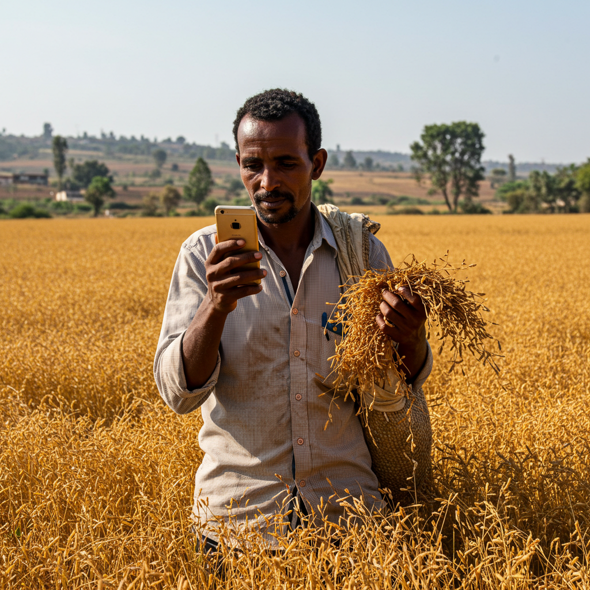

# 🌾 Smart Gebere - Intelligent Agriculture Assistant

<div align="center">



**An AI-powered mobile application designed to revolutionize farming practices for Ethiopian farmers**

[](https://flutter.dev/)
[](https://firebase.google.com/)
[](https://ai.google.dev/)
[](LICENSE)

[Features](#-features) • [Installation](#-installation) • [Architecture](#-architecture) • [API Documentation](#-api-documentation) • [Contributing](#-contributing)

</div>

---

## 📋 Table of Contents

1. [Overview](#-overview)
2. [Features](#-features)
3. [Technology Stack](#-technology-stack)
4. [Architecture](#-architecture)
5. [Installation & Setup](#-installation--setup)
6. [Configuration](#-configuration)
7. [Project Structure](#-project-structure)
8. [Core Modules](#-core-modules)
9. [API Documentation](#-api-documentation)
10. [Database Schema](#-database-schema)
11. [Localization](#-localization)
12. [Security](#-security)
13. [Testing](#-testing)
14. [Deployment](#-deployment)
15. [Troubleshooting](#-troubleshooting)
16. [Roadmap](#-roadmap)
17. [Contributing](#-contributing)
18. [License](#-license)

---

## 🌍 Overview

**Smart Gebere** (ስማርት ገበሬ - "Smart Farmer" in Amharic) is a comprehensive agricultural assistant application built with Flutter. It leverages artificial intelligence, GPS technology, and real-time weather data to provide Ethiopian farmers with personalized crop recommendations, disease detection, yield predictions, and farm management tools.

### Mission Statement

> To empower Ethiopian farmers with cutting-edge technology, enabling data-driven decisions that increase crop yields, reduce losses, and promote sustainable farming practices.

### Key Objectives

- 🎯 **Personalized Recommendations**: AI-powered crop suggestions based on location, climate, and soil conditions
- 🔬 **Disease Detection**: Image-based plant disease diagnosis using computer vision
- 📅 **Smart Planning**: Week-by-week farming guides tailored to specific crops and fields
- 📊 **Yield Prediction**: AI-powered harvest forecasting and market value estimation
- 🗺️ **Field Mapping**: GPS-based land measurement and management
- 🌐 **Multi-language Support**: Available in English, Amharic (አማርኛ), and Afaan Oromo

---

## ✨ Features

### 🏠 Home Dashboard

The central hub of the application featuring:

| Component | Description |
|-----------|-------------|
| **Weather Widget** | Real-time weather data for the farmer's location |
| **Quick Actions** | One-tap access to key features |
| **Created Tasks** | Slideshow of active crop plans with progress |
| **Expected Events** | Upcoming farming tasks and deadlines |
| **Navigation Drawer** | Access to all app features |

### 🌱 AI Crop Recommendations

```
Location Data → Weather API → Elevation API → Gemini AI → Personalized Crop List
```

**How it works:**
1. Fetches current GPS coordinates
2. Retrieves elevation data from Open-Elevation API
3. Gets real-time weather from OpenWeather API
4. Optionally includes user's mapped field data (size, soil type)
5. Sends comprehensive data to Gemini AI
6. Returns ranked crop suggestions with suitability scores

**Output includes:**
- Crop name and description
- Suitability percentage (0-100%)
- Climate suitability analysis
- Soil requirements
- Water needs assessment
- Elevation factor analysis
- Seasonal growth patterns

### 🩺 AI Crop Doctor

An intelligent chat assistant for farming questions and plant diagnosis.

**Capabilities:**
- Real-time chat with Gemini AI
- Photo-based plant disease diagnosis
- Pest control advice (organic methods prioritized)
- Irrigation and fertilization guidance
- Crop-specific question answering
- Multi-language responses

**Technical Implementation:**
```dart
// Image-based diagnosis
Content.multi([
  TextPart(prompt),
  DataPart('image/jpeg', imageBytes),
])

// Text-based chat
ChatSession.sendMessage(Content.text(userQuery))
```

### 🔬 Disease Detection

Advanced image analysis for plant disease identification.

**Features:**
- Camera and gallery image input
- Real-time disease detection
- Confidence score display
- Treatment recommendations
- Detection history
- Share results functionality

**AI Prompt Structure:**
```
Analyze this plant image and provide:
1. Plant identification
2. Disease/problem detection
3. Severity assessment
4. Treatment recommendations
5. Prevention tips
```

### 📅 Crop Planning & Scheduling

Week-by-week farming guides generated by AI.

**Data Structure:**
```json
{
  "week": 1,
  "date_range": ["2025-01-01", "2025-01-07"],
  "stage": "Land Preparation",
  "tasks": [
    "Test soil pH and adjust as necessary",
    "Plow the field to a depth of 15 cm",
    "Add organic compost"
  ],
  "completedTasks": [0, 2]
}
```

**Stages Covered:**
1. 🏗️ Land Preparation
2. 🌱 Planting/Sowing
3. 📈 Growth & Maintenance
4. 🌸 Flowering
5. 🌾 Harvest

### 📊 Yield Prediction & Analytics

AI-powered harvest forecasting system.

**Inputs:**
- Selected crop
- Land size (hectares/acres/timad)
- Seed amount
- Fertilizer used
- Field data (if mapped)

**Outputs:**
```json
{
  "estimated_yield_min": 1500,
  "estimated_yield_max": 2500,
  "yield_per_hectare": 2000,
  "confidence_percentage": 85,
  "market_value_estimate_min": 45000,
  "market_value_estimate_max": 75000,
  "harvest_quality_prediction": "good",
  "optimal_harvest_timing": "When 90% of grains are golden",
  "factors_affecting_yield": [...],
  "recommendations": [...]
}
```

### 🗺️ GPS Field Mapping

Precise land measurement using GPS coordinates.

**Features:**
- Real-time GPS tracking
- Walk-the-boundary mapping
- Automatic area calculation (Shoelace formula)
- Multiple soil type options
- Save and manage multiple fields
- Integration with crop recommendations

**Area Calculation:**
```dart
// Shoelace formula for polygon area
double _calculatePolygonArea(List<LatLng> points) {
  double area = 0;
  for (int i = 0; i < n; i++) {
    int j = (i + 1) % n;
    area += x1 * y2 - x2 * y1;
  }
  return (area.abs() / 2) / 10000; // hectares
}
```

**Supported Soil Types:**
- Loam
- Clay
- Sandy
- Silt
- Vertisol (Black Cotton)
- Nitosol (Red)
- Andosol

### 📈 Market Prices

Real-time agricultural commodity prices.

**Features:**
- Price trends visualization
- Historical data charts
- Regional price comparison
- Price alerts (planned)

### 🌤️ Weather Advisor

Comprehensive weather information for farming decisions.

**Data Provided:**
- Current temperature
- Humidity levels
- Weather conditions
- 7-day forecast
- Farming recommendations based on weather

### 📚 Knowledge Base

Educational content for farmers.

**Categories:**
- Crop guides
- Pest management
- Soil health
- Water management
- Post-harvest handling
- Market information

### 📝 Farm Records

Digital record-keeping for farm activities.

**Record Types:**
- Planting records
- Harvest records
- Input purchases
- Sales records
- Expense tracking

### 👤 Farmer Profile

User profile and farm information management.

**Profile Data:**
- Personal information
- Farm location
- Land holdings
- Crop history
- Preferences

---

## 🛠️ Technology Stack

### Frontend

| Technology | Purpose | Version |
|------------|---------|---------|
| **Flutter** | Cross-platform UI framework | 3.x |
| **Dart** | Programming language | 3.x |
| **Provider** | State management | 6.x |
| **Google Fonts** | Typography | 6.x |
| **FL Chart** | Data visualization | 0.69.x |

### Backend & Services

| Service | Purpose |
|---------|---------|
| **Firebase Auth** | User authentication |
| **Cloud Firestore** | NoSQL database |
| **Google Gemini AI** | AI/ML capabilities |
| **OpenWeather API** | Weather data |
| **Open-Elevation API** | Elevation data |

### Core Packages

```yaml
dependencies:
  # Firebase
  firebase_core: ^3.12.1
  firebase_auth: ^5.5.1
  cloud_firestore: ^5.6.5

  # AI & ML
  google_generative_ai: ^0.4.6

  # Location
  geolocator: ^13.0.2

  # Media
  image_picker: ^1.1.2

  # UI
  google_fonts: ^6.2.1
  fl_chart: ^0.69.2
  awesome_dialog: ^3.2.1

  # Storage
  shared_preferences: ^2.x
  hive: ^2.x
  hive_flutter: ^1.x

  # Utilities
  http: ^1.3.0
  intl: ^0.19.0
  flutter_dotenv: ^5.2.1
  provider: ^6.1.2
  uuid: ^4.5.1
```

---

## 🏗️ Architecture

### Application Architecture

```
┌─────────────────────────────────────────────────────────────┐
│                      PRESENTATION LAYER                      │
│  ┌─────────┐ ┌─────────┐ ┌─────────┐ ┌─────────┐           │
│  │  Pages  │ │ Widgets │ │ Dialogs │ │  Cards  │           │
│  └────┬────┘ └────┬────┘ └────┬────┘ └────┬────┘           │
└───────┼───────────┼───────────┼───────────┼─────────────────┘
        │           │           │           │
        ▼           ▼           ▼           ▼
┌─────────────────────────────────────────────────────────────┐
│                       BUSINESS LAYER                         │
│  ┌────────────┐ ┌────────────┐ ┌────────────┐              │
│  │  Services  │ │  Providers │ │   Models   │              │
│  └─────┬──────┘ └─────┬──────┘ └─────┬──────┘              │
└────────┼──────────────┼──────────────┼──────────────────────┘
         │              │              │
         ▼              ▼              ▼
┌─────────────────────────────────────────────────────────────┐
│                        DATA LAYER                            │
│  ┌───────────┐ ┌───────────┐ ┌───────────┐ ┌───────────┐   │
│  │ Firebase  │ │ Gemini AI │ │  Weather  │ │   Local   │   │
│  │ Firestore │ │    API    │ │    API    │ │  Storage  │   │
│  └───────────┘ └───────────┘ └───────────┘ └───────────┘   │
└─────────────────────────────────────────────────────────────┘
```

### Data Flow

```
User Action
    │
    ▼
┌─────────────┐
│   Widget    │ ◄─── State Management (Provider/setState)
└──────┬──────┘
       │
       ▼
┌─────────────┐
│   Service   │ ◄─── Business Logic
└──────┬──────┘
       │
       ▼
┌─────────────┐
│  External   │ ◄─── Firebase / APIs / AI
│   Service   │
└──────┬──────┘
       │
       ▼
   Response
       │
       ▼
   UI Update
```

### State Management

The app uses a combination of:

1. **Provider** - For app-wide state (settings, user info)
2. **StatefulWidget** - For local component state
3. **FutureBuilder/StreamBuilder** - For async data

```dart
// Global state example
class AppSettings extends ChangeNotifier {
  Locale _locale = const Locale('en');
  
  Locale get locale => _locale;
  
  Future<void> setLocale(Locale newLocale) async {
    _locale = newLocale;
    await _persistLocale(newLocale);
    notifyListeners();
  }
}
```

---

## 🚀 Installation & Setup

### Prerequisites

- Flutter SDK 3.x or higher
- Dart SDK 3.x or higher
- Android Studio / VS Code
- Firebase CLI
- Git

### Step 1: Clone Repository

```bash
git clone https://github.com/your-org/smart-gebere.git
cd smart-gebere/Smart_Gebere
```

### Step 2: Install Dependencies

```bash
flutter pub get
```

### Step 3: Firebase Setup

1. Create a Firebase project at [Firebase Console](https://console.firebase.google.com/)
2. Enable Authentication (Email/Password)
3. Enable Cloud Firestore
4. Download configuration files:
   - `google-services.json` → `android/app/`
   - `GoogleService-Info.plist` → `ios/Runner/`

### Step 4: Environment Configuration

Create `.env` file in project root:

```env
# API Keys
API_KEY=your_gemini_api_key
GEMINI_API_KEY=your_gemini_api_key
OPENWEATHER_API_KEY=your_openweather_api_key

# Model Configuration
GEMINI_MODEL=gemini-1.5-flash
```

### Step 5: Run Application

```bash
# Development
flutter run

# Web
flutter run -d chrome

# Android
flutter run -d android

# iOS
flutter run -d ios

# Build APK
flutter build apk --release

# Build iOS
flutter build ios --release
```

---

## ⚙️ Configuration

### Environment Variables

| Variable | Description | Required |
|----------|-------------|----------|
| `API_KEY` | Gemini AI API key | ✅ |
| `GEMINI_API_KEY` | Alternative Gemini key | ✅ |
| `OPENWEATHER_API_KEY` | Weather API key | ✅ |
| `GEMINI_MODEL` | AI model name | ❌ (default: gemini-1.5-flash) |

### Firebase Configuration

**Firestore Security Rules:**

```javascript
rules_version = '2';
service cloud.firestore {
  match /databases/{database}/documents {
    // Users collection
    match /users/{userId} {
      allow read, write: if request.auth != null && request.auth.uid == userId;
    }
    
    // Farmers collection
    match /Farmers/{userId} {
      allow read, write: if request.auth != null && request.auth.uid == userId;
    }
    
    // Public content
    match /content/{document=**} {
      allow read: if request.auth != null;
      allow write: if false;
    }
  }
}
```

---

## 📁 Project Structure

```
Smart_Gebere/
├── android/                    # Android-specific code
├── ios/                        # iOS-specific code
├── web/                        # Web-specific code
├── lib/
│   ├── main.dart              # Application entry point
│   │
│   ├── auth/                  # Authentication
│   │   ├── login/
│   │   │   └── login.dart     # Login page
│   │   └── signup/
│   │       └── sign_up.dart   # Registration page
│   │
│   ├── Home/                  # Home module
│   │   ├── Home.dart          # Main dashboard
│   │   ├── task_creation.dart # Task creation cards
│   │   ├── created_task.dart  # Active crops display
│   │   ├── expected_event.dart # Upcoming tasks
│   │   ├── cropdetailpage.dart # Crop details
│   │   └── weeklydetailpage.dart # Weekly details
│   │
│   ├── Disease_page/          # Disease detection
│   │   └── DiseaseDetection.dart
│   │
│   ├── geo_Location/          # Location services
│   │   └── location.dart      # GPS & weather
│   │
│   ├── scheduling/            # Crop planning
│   │   └── schedule.dart      # Week-by-week planner
│   │
│   ├── task_management/       # Task management
│   │   ├── descrition.dart    # Agriculture intro page
│   │   └── list_suggestion.dart # Crop suggestions
│   │
│   ├── features/              # Feature modules
│   │   ├── ai_doctor/
│   │   │   └── ai_crop_doctor_page.dart
│   │   ├── yield_prediction/
│   │   │   └── yield_prediction_page.dart
│   │   ├── field_mapping/
│   │   │   └── field_mapping_page.dart
│   │   ├── market_prices/
│   │   │   └── market_prices_page.dart
│   │   ├── weather_advisor/
│   │   │   └── weather_advisor_page.dart
│   │   ├── farm_records/
│   │   │   └── farm_records_page.dart
│   │   ├── farm_profile/
│   │   │   └── farm_profile_page.dart
│   │   ├── knowledge_base/
│   │   │   └── knowledge_base_page.dart
│   │   └── privacy/
│   │       └── privacy_page.dart
│   │
│   ├── core/                  # Core services
│   │   ├── services/
│   │   │   ├── connectivity_service.dart
│   │   │   ├── connectivity_io.dart
│   │   │   ├── connectivity_web.dart
│   │   │   ├── connectivity_stub.dart
│   │   │   ├── offline_storage.dart
│   │   │   ├── ai_reliability.dart
│   │   │   └── content_service.dart
│   │   └── models/
│   │       ├── farm_profile.dart
│   │       ├── farm_record.dart
│   │       ├── market_price.dart
│   │       ├── knowledge_article.dart
│   │       └── detection_history.dart
│   │
│   ├── settings/              # App settings
│   │   ├── app_settings.dart
│   │   ├── settings_page.dart
│   │   ├── locale_store.dart
│   │   ├── locale_store_io.dart
│   │   ├── locale_store_web.dart
│   │   └── locale_store_stub.dart
│   │
│   ├── l10n/                  # Localization
│   │   ├── app_localizations.dart
│   │   ├── fallback_localizations.dart
│   │   ├── app_en.arb
│   │   ├── app_am.arb
│   │   └── app_om.arb
│   │
│   ├── stream/                # Auth state
│   │   └── stream_provider.dart
│   │
│   ├── splash/                # Splash screen
│   │   └── splash_screen.dart
│   │
│   ├── onboarding/            # Onboarding
│   │   └── onboarding_page.dart
│   │
│   └── Loading/               # Loading states
│       └── loading.dart
│
├── assets/                    # Static assets
│   ├── image_1.jpg
│   └── ...
│
├── .env                       # Environment variables
├── pubspec.yaml              # Dependencies
├── firestore.rules           # Firestore rules
├── firebase.json             # Firebase config
└── README.md                 # This file
```

---

## 🧩 Core Modules

### 1. Authentication Module

**Location:** `lib/auth/`

Handles user authentication using Firebase Auth.

```dart
// Login
await FirebaseAuth.instance.signInWithEmailAndPassword(
  email: email,
  password: password,
);

// Signup
await FirebaseAuth.instance.createUserWithEmailAndPassword(
  email: email,
  password: password,
);

// Logout
await FirebaseAuth.instance.signOut();
```

**Features:**
- Email/password authentication
- Password visibility toggle
- Form validation
- Error handling with user-friendly messages
- Animated transitions

### 2. Location Service

**Location:** `lib/geo_Location/location.dart`

Provides GPS coordinates, elevation, and weather data.

```dart
class LocationService {
  // Get current location with all data
  Future<Map<String, dynamic>> getCurrentLocation();
  
  // Get elevation for coordinates
  Future<double> getElevation(double lat, double lon);
  
  // Get weather data
  Future<Map<String, dynamic>> getWeather(double lat, double lon);
  
  // Generate AI crop suggestions
  Future<List<Map<String, dynamic>>> generateCropSuggestions(
    Map<String, dynamic> locationData, {
    Map<String, dynamic>? fieldData,
  });
}
```

### 3. AI Integration

**Multiple AI-powered features using Gemini:**

```dart
// Initialize model
final model = GenerativeModel(
  model: 'gemini-1.5-flash',
  apiKey: apiKey,
  safetySettings: [...],
  systemInstruction: Content.text('...'),
);

// Text generation
final response = await model.generateContent([Content.text(prompt)]);

// Image analysis
final response = await model.generateContent([
  Content.multi([
    TextPart(prompt),
    DataPart('image/jpeg', imageBytes),
  ])
]);

// Chat session
final chatSession = model.startChat();
final response = await chatSession.sendMessage(Content.text(message));
```

### 4. Offline Storage

**Location:** `lib/core/services/offline_storage.dart`

Local data persistence using Hive.

```dart
class OfflineStorage {
  Future<void> init();
  Future<void> saveCrops(List<Map<String, dynamic>> crops);
  Future<List<Map<String, dynamic>>> getCrops();
  Future<void> savePendingSync(Map<String, dynamic> data);
  Future<List<Map<String, dynamic>>> getPendingSync();
}
```

### 5. Connectivity Service

**Location:** `lib/core/services/connectivity_service.dart`

Cross-platform network status monitoring.

```dart
abstract class ConnectivityService {
  Stream<bool> get onConnectivityChanged;
  Future<bool> isConnected();
}

// Platform-specific implementations
// - connectivity_io.dart (Mobile/Desktop)
// - connectivity_web.dart (Web)
```

---

## 📡 API Documentation

### External APIs

#### 1. Gemini AI API

**Endpoint:** `https://generativelanguage.googleapis.com/v1beta/`

**Authentication:** API Key

**Models Used:**
- `gemini-1.5-flash` (primary)
- `gemini-2.5-flash` (preferred, with fallback)

**Usage Examples:**

```dart
// Crop recommendations
String prompt = """
Based on the following location data, provide crop recommendations:
- Latitude: ${lat}
- Longitude: ${lon}
- Elevation: ${elevation}m
- Temperature: ${temp}°C
...
""";

// Disease detection
String prompt = """
Analyze this plant image and provide:
1. Plant identification
2. Disease detection
3. Treatment recommendations
...
""";
```

#### 2. OpenWeather API

**Endpoint:** `https://api.openweathermap.org/data/2.5/weather`

**Parameters:**
- `lat` - Latitude
- `lon` - Longitude
- `appid` - API key
- `units` - metric

**Response:**
```json
{
  "main": {
    "temp": 25.5,
    "humidity": 65
  },
  "weather": [{
    "description": "scattered clouds"
  }]
}
```

#### 3. Open-Elevation API

**Endpoint:** `https://api.open-elevation.com/api/v1/lookup`

**Request:**
```json
{
  "locations": [
    {"latitude": 9.0, "longitude": 38.75}
  ]
}
```

**Response:**
```json
{
  "results": [{
    "elevation": 2355
  }]
}
```

---

## 🗄️ Database Schema

### Firestore Collections

#### `Farmers/{userId}`

```typescript
interface Farmer {
  // Profile
  name?: string;
  phone?: string;
  region?: string;
  
  // Fields (mapped GPS fields)
  fields?: Field[];
  
  // Crops (active crop plans)
  crops?: Crop[];
}

interface Field {
  id: string;
  name: string;
  soilType: string;
  areaHectares: number;
  points: {lat: number, lng: number}[];
  createdAt: string;
}

interface Crop {
  id: string;
  name: string;
  weeks: Week[];
  progressPercentage: number;
  daysSinceFirstPlanting: number;
  createdAt: string;
  fieldId?: string;
  fieldName?: string;
  fieldAreaHectares?: number;
  soilType?: string;
}

interface Week {
  week: number;
  date_range: [string, string];
  stage: string;
  tasks: string[];
  completedTasks?: number[];
}
```

#### `users/{userId}`

```typescript
interface User {
  email: string;
  createdAt: Timestamp;
  lastLogin: Timestamp;
  settings?: UserSettings;
}

interface UserSettings {
  language: string;
  notifications: boolean;
}
```

---

## 🌐 Localization

### Supported Languages

| Language | Code | Status |
|----------|------|--------|
| English | `en` | ✅ Complete |
| Amharic (አማርኛ) | `am` | ✅ Complete |
| Afaan Oromo | `om` | ✅ Complete |

### Implementation

**Location:** `lib/l10n/`

**Usage:**
```dart
final l10n = AppLocalizations.of(context);
Text(l10n.welcomeMessage);
Text(l10n.createTask);
```

**Adding New Strings:**

1. Add to `app_en.arb`:
```json
{
  "newString": "English text"
}
```

2. Add to `app_am.arb`:
```json
{
  "newString": "የአማርኛ ጽሑፍ"
}
```

3. Add to `app_om.arb`:
```json
{
  "newString": "Afaan Oromo text"
}
```

4. Add to `AppLocalizations` class:
```dart
String get newString => _localizedValues[locale.languageCode]?['newString'] ?? 'Default';
```

### Changing Language

```dart
// In SettingsPage
await settings.setLocale(Locale('am')); // Switch to Amharic
```

---

## 🔒 Security

### Authentication

- Firebase Authentication with email/password
- Secure token management
- Session persistence

### Data Protection

- Firestore security rules enforce user-level access
- No cross-user data access
- API keys stored in `.env` (not committed)

### Best Practices

1. **API Keys:** Never commit `.env` files
2. **User Data:** Encrypt sensitive local storage
3. **Network:** All API calls over HTTPS
4. **Validation:** Server-side validation in Firestore rules

### Security Rules

```javascript
// Only authenticated users can access their own data
match /Farmers/{userId} {
  allow read, write: if request.auth != null 
                     && request.auth.uid == userId;
}
```

---

## 🧪 Testing

### Unit Tests

```bash
flutter test
```

### Integration Tests

```bash
flutter test integration_test/
```

### Widget Tests

```dart
testWidgets('Login button works', (tester) async {
  await tester.pumpWidget(MyApp());
  await tester.tap(find.text('Login'));
  await tester.pump();
  expect(find.text('Welcome'), findsOneWidget);
});
```

---

## 📦 Deployment

### Android

```bash
# Generate release APK
flutter build apk --release

# Generate App Bundle
flutter build appbundle --release
```

**Output:** `build/app/outputs/flutter-apk/app-release.apk`

### iOS

```bash
flutter build ios --release
```

Then archive and upload via Xcode.

### Web

```bash
flutter build web --release
```

**Output:** `build/web/`

Deploy to Firebase Hosting:
```bash
firebase deploy --only hosting
```

---

## 🔧 Troubleshooting

### Common Issues

#### 1. AssetManifest.json Error (Web)

```
Error: Unable to load asset: "AssetManifest.json"
```

**Solution:**
```bash
flutter clean
flutter pub get
flutter run -d chrome
```

#### 2. Firestore Permission Denied

```
Error: PERMISSION_DENIED
```

**Solution:**
1. Deploy Firestore rules: `firebase deploy --only firestore:rules`
2. Verify user is authenticated
3. Check collection path matches rules

#### 3. Gemini API Model Not Found

```
Error: model is not found
```

**Solution:**
- Update `GEMINI_MODEL` in `.env` to `gemini-1.5-flash`
- The app has automatic fallback to this model

#### 4. Location Permission Denied

**Solution:**
- Android: Check `AndroidManifest.xml` permissions
- iOS: Check `Info.plist` usage descriptions
- Request permission in app before accessing location

#### 5. MissingPluginException on Web

```
MissingPluginException: No implementation found
```

**Solution:**
- For `shared_preferences`: App uses cross-platform `LocaleStore`
- For `connectivity_plus`: App uses platform-specific implementations
- Ensure `flutter pub get` and full restart

---

## 🗺️ Roadmap

### Phase 1: Core Features ✅

- [x] User authentication
- [x] GPS-based crop recommendations
- [x] Disease detection
- [x] Crop planning/scheduling
- [x] Multi-language support

### Phase 2: Advanced Features ✅

- [x] AI Crop Doctor chat
- [x] Yield prediction
- [x] GPS field mapping
- [x] Task completion tracking
- [x] Progress calculation

### Phase 3: Enhancement (In Progress)

- [ ] Push notifications
- [ ] Offline-first mode
- [ ] Voice input for chat
- [ ] Community forums
- [ ] Expert consultation

### Phase 4: Future

- [ ] IoT sensor integration
- [ ] Drone imagery support
- [ ] Marketplace integration
- [ ] Government scheme information
- [ ] Insurance integration

---

## 🤝 Contributing

### Getting Started

1. Fork the repository
2. Create a feature branch: `git checkout -b feature/amazing-feature`
3. Commit changes: `git commit -m 'Add amazing feature'`
4. Push to branch: `git push origin feature/amazing-feature`
5. Open a Pull Request

### Code Style

- Follow [Dart style guide](https://dart.dev/guides/language/effective-dart/style)
- Use meaningful variable names
- Add comments for complex logic
- Write tests for new features

### Commit Messages

```
feat: add yield prediction feature
fix: resolve login error on iOS
docs: update API documentation
style: format code with dartfmt
refactor: simplify location service
test: add unit tests for auth
```

---

## 📄 License

This project is licensed under the MIT License - see the [LICENSE](LICENSE) file for details.

---

## 👥 Team

**Smart Gebere Development Team**

- Project Lead
- Flutter Developers
- UI/UX Designers
- AI/ML Engineers
- QA Engineers

---

## 📞 Support

For support, please:

1. Check the [Troubleshooting](#-troubleshooting) section
2. Search existing [Issues](https://github.com/your-org/smart-gebere/issues)
3. Create a new issue with:
   - Device/platform information
   - Steps to reproduce
   - Expected vs actual behavior
   - Screenshots if applicable

---

## 🙏 Acknowledgments

- [Flutter Team](https://flutter.dev/) for the amazing framework
- [Firebase](https://firebase.google.com/) for backend services
- [Google AI](https://ai.google.dev/) for Gemini AI capabilities
- [OpenWeather](https://openweathermap.org/) for weather data
- Ethiopian farming community for domain expertise

---

<div align="center">

**Made with ❤️ for Ethiopian Farmers**

🌾 Smart Gebere - ስማርት ገበሬ 🌾

</div>
